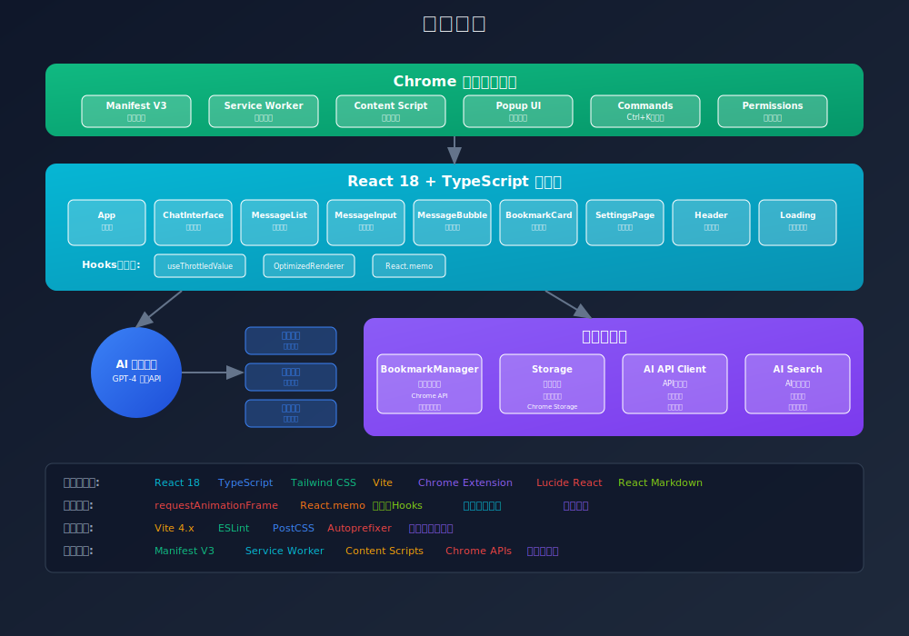

# 书签精灵 (Bookmark Genie)

一个基于AI技术的智能书签管理Chrome扩展，支持自然语言查询、智能搜索和对话式交互。


## ✨ 功能特性

- 🤖 **AI智能对话**: 通过自然语言与AI助手对话查找书签，支持流式响应
- 📚 **智能书签管理**: 自动保存书签元数据，支持描述和标签
- 🔍 **混合搜索算法**: AI搜索 + 本地搜索双重保障，确保最佳搜索体验
- 💬 **对话式交互**: 现代化聊天界面，支持实时流式对话
- ⚡ **快捷键支持**: Ctrl+K (Mac: Cmd+K) 快速唤起
- ⚙️ **灵活配置**: 支持多种AI模型和自定义API配置
- 🌐 **跨浏览器兼容**: 支持所有基于Chromium的浏览器
- 🎨 **现代UI设计**: 基于Tailwind CSS的响应式设计

## 🛠 技术架构

- **前端框架**: React 18 + TypeScript
- **UI组件**: Tailwind CSS + Lucide React Icons
- **扩展架构**: Chrome Extension Manifest V3
- **后台服务**: Service Worker
- **数据管理**: Chrome Bookmarks API + Chrome Storage API
- **AI集成**: 支持OpenAI兼容API (流式响应)
- **性能优化**: requestAnimationFrame + React.memo + 自定义Hooks
- **构建工具**: Vite + 自定义构建脚本
- **代码质量**: ESLint + TypeScript 严格模式
- **样式工具**: clsx + tailwind-merge
- **Markdown渲染**: react-markdown

## 🚀 快速开始

### 环境要求
- Node.js 16+ 
- npm 或 yarn
- Chrome/Edge 浏览器

### 安装依赖
```bash
npm install
```

### 构建扩展
```bash
npm run build:extension
```
构建完成后，扩展文件将输出到 `dist` 目录。

## 📦 安装扩展

### 开发版本安装
1. 克隆项目并构建：
   ```bash
   git clone <repository-url>
   cd bookmark-genie
   npm install
   npm run build:extension
   ```

2. 在Chrome中加载扩展：
   - 打开 `chrome://extensions/`
   - 开启"开发者模式"
   - 点击"加载未打包的扩展程序"
   - 选择项目的 `dist` 目录

### 生产版本
暂无

## 📖 使用指南

### 基本使用
1. **打开扩展**: 点击浏览器工具栏中的书签精灵图标
2. **AI对话**: 在聊天界面输入自然语言查询：
   - "帮我找找关于React的书签"
   - "最近保存的技术文档" 
   - "有关机器学习的网站"
   - "昨天收藏的那个设计网站"

### 快捷键
- `Ctrl+K` (Windows/Linux) 或 `Cmd+K` (Mac) - 快速打开扩展

### AI配置
1. 点击设置按钮 ⚙️
2. 配置AI API：
   - **API密钥**: 输入OpenAI或兼容API的密钥
   - **API地址**: 默认为OpenAI，可自定义
   - **模型选择**: 支持GPT、智谱等模型
   - **参数调整**: 可调整温度、最大token等参数

### 搜索模式
- **AI模式**: 配置API后，使用AI理解查询意图
- **本地模式**: 未配置API时，使用本地算法搜索
- **混合模式**: AI搜索失败时自动降级到本地搜索

## 📁 项目结构

```
bookmark-genie/
├── public/                 # 静态资源
│   ├── manifest.json      # 扩展清单文件
│   └── icons/             # 扩展图标
├── scripts/               # 构建脚本
│   └── build-extension.js # 扩展构建脚本
├── src/
│   ├── background/        # 后台服务
│   │   └── service-worker.ts
│   ├── content/          # 内容脚本
│   │   └── content-script.ts
│   ├── popup/            # 弹出窗口
│   │   ├── App.tsx       # 主应用组件
│   │   ├── main.tsx      # 入口文件
│   │   └── index.html    # HTML模板
│   ├── components/       # React组件
│   │   ├── ChatInterface.tsx    # 聊天界面
│   │   ├── MessageBubble.tsx    # 消息气泡
│   │   ├── MessageInput.tsx     # 消息输入框
│   │   ├── MessageList.tsx      # 消息列表
│   │   ├── OptimizedRenderer.tsx # 性能优化渲染器
│   │   ├── BookmarkCard.tsx     # 书签卡片
│   │   ├── Header.tsx           # 头部组件
│   │   ├── LoadingIndicator.tsx # 加载指示器
│   │   └── SettingsPage.tsx     # 设置页面
│   ├── hooks/            # 自定义Hooks
│   │   └── useThrottledValue.ts # 性能优化Hooks
│   ├── utils/            # 工具函数
│   │   ├── storage.ts           # 存储管理
│   │   ├── ai-api.ts            # AI API客户端
│   │   ├── ai-search.ts         # AI搜索逻辑
│   │   ├── bookmark-manager.ts  # 书签管理器
│   │   └── cn.ts                # 样式工具
│   ├── types/            # TypeScript类型定义
│   │   └── index.ts
│   └── styles/           # 样式文件
│       └── globals.css   # 全局样式
├── package.json          # 项目配置
├── vite.config.ts        # Vite配置
├── tailwind.config.js    # Tailwind配置
└── tsconfig.json         # TypeScript配置
```

## 🔧 核心功能实现

### AI搜索引擎
- **流式响应**: 支持实时流式AI对话，优化渲染性能
- **智能降级**: AI失败时自动使用本地搜索
- **Token优化**: 智能处理大量书签，避免API限制
- **多模型支持**: 兼容OpenAI及其他兼容API
- **性能优化**: 使用requestAnimationFrame优化流式渲染，减少抖动

### 书签管理
- **实时同步**: 直接读取Chrome书签API，无需额外存储
- **智能搜索**: 基于标题、URL、描述的多维度相关性评分（本地搜索）
- **时间加权**: 最近添加的书签在搜索中获得更高权重（本地搜索）

### 用户界面
- **响应式设计**: 适配不同屏幕尺寸
- **现代化UI**: 基于Tailwind CSS的精美界面
- **性能优化**: 使用React.memo和自定义hooks优化渲染性能

## 🚧 开发计划

### 已完成 ✅
- [x] 基础架构搭建 (React + TypeScript + Vite)
- [x] Chrome扩展配置 (Manifest V3)
- [x] 后台服务实现 (Service Worker)
- [x] React应用界面 (现代化UI设计)
- [x] 书签搜索功能 (本地 + AI混合搜索)
- [x] AI API集成 (流式响应支持)
- [x] 设置页面 (完整的配置界面)
- [x] 消息系统 (实时聊天界面)
- [x] 书签管理器 (直接读取Chrome API)
- [x] 性能优化 (流式渲染优化，减少抖动)
- [x] UI交互优化 (输入框对齐，无滚动动画)
- [x] 自定义Hooks (性能优化相关)
- [x] 主题系统优化 (浅色主题完善)
- [x] 性能优化 (requestAnimationFrame优化)

### 进行中 🚀
暂无

### 计划中 📋
- [ ] Chrome 扩展中心发布
- [ ] 如果没有相关的书签，就尝试从互联网上找相关的网站
- [ ] 全屏按钮
- [ ] 保存书签时调用 AI 进行分类和规整
- [ ] 当书签过多时，允许 AI 通过工具分批次读取书签内容

## 🤝 贡献指南

我们欢迎所有形式的贡献！

### 如何贡献
1. Fork 本仓库
2. 创建特性分支 (`git checkout -b feature/AmazingFeature`)
3. 提交更改 (`git commit -m 'Add some AmazingFeature'`)
4. 推送到分支 (`git push origin feature/AmazingFeature`)
5. 开启 Pull Request

### 开发规范
- 使用 TypeScript 进行类型安全开发
- 遵循 ESLint 代码规范
- 组件采用函数式组件 + Hooks
- 样式使用 Tailwind CSS
- 提交信息遵循 Conventional Commits

## 致谢

- [React](https://reactjs.org/) - 用户界面库
- [Tailwind CSS](https://tailwindcss.com/) - CSS框架
- [Lucide React](https://lucide.dev/) - 图标库
- [Vite](https://vitejs.dev/) - 构建工具

---

## 联系作者

微信：co_pine


**如果这个项目对你有帮助，请给个 ⭐️ 支持一下！**
